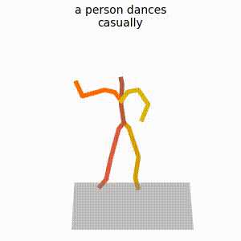
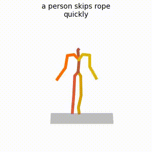
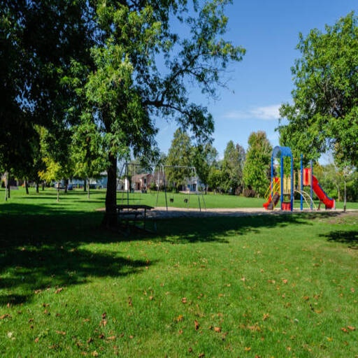
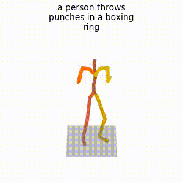
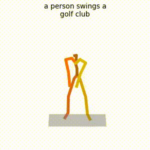
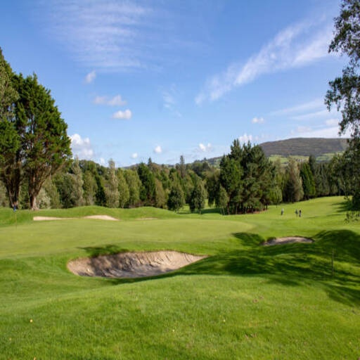

# SATM: Scene-Aware Text-to-Motion Generation

SATM generates a 3D human-motion video from two conditions: a short English action description and a compatible scene image. For example, use `a person dribbles a basketball` with an image of a basketball court.

This repository contains source code and reproducibility tools. Large assets (trained weights, HumanML3D, SMPL files, and scene images) are deliberately not committed to Git. Some have their own licences and must be obtained from an authorised source. See [docs/ASSETS.md](docs/ASSETS.md).

## Selected qualitative examples

The following selected examples demonstrate SATM with a fixed scene image. Each card shows the generated motion preview on the left and the scene condition on the right. Use **Watch / download MP4** to open the original video file.

<table>
<tr>
<td width="50%" align="center">
<strong>Prompt: <code>a person dances casually</code></strong><br>
 <br><em>Generated motion preview | scene condition</em><br>
<a href="examples/qualitative_showcase/01_casual_dance/satm_text_scene.mp4">[Play] Watch / download MP4</a> | <a href="examples/qualitative_showcase/01_casual_dance/">Example files</a>
</td>
<td width="50%" align="center">
<strong>Prompt: <code>a person skips rope quickly</code></strong><br>
 <br><em>Generated motion preview | scene condition</em><br>
<a href="examples/qualitative_showcase/02_rope_skipping/satm_text_scene.mp4">[Play] Watch / download MP4</a> | <a href="examples/qualitative_showcase/02_rope_skipping/">Example files</a>
</td>
</tr>
<tr>
<td width="50%" align="center">
<strong>Prompt: <code>a person throws punches in a boxing ring</code></strong><br>
 <br><em>Generated motion preview | scene condition</em><br>
<a href="examples/qualitative_showcase/03_boxing/satm_text_scene.mp4">[Play] Watch / download MP4</a> | <a href="examples/qualitative_showcase/03_boxing/">Example files</a>
</td>
<td width="50%" align="center">
<strong>Prompt: <code>a person swings a golf club</code></strong><br>
 <br><em>Generated motion preview | scene condition</em><br>
<a href="examples/qualitative_showcase/04_golf_swing/satm_text_scene.mp4">[Play] Watch / download MP4</a> | <a href="examples/qualitative_showcase/04_golf_swing/">Example files</a>
</td>
</tr>
</table>

These are selected qualitative demonstrations. They do not by themselves constitute a statistical comparison against a text-only baseline. Full setup instructions and asset requirements are documented above and in [docs/ASSETS.md](docs/ASSETS.md).

## Platform support

The Windows workflow below is the tested and supported setup. Linux has not been independently validated for this SATM release; `environment.yml` is retained as a legacy upstream environment reference and should not be treated as a tested Linux installation recipe.
## Requirements

- Windows 10/11, Conda / Miniconda, Git, and an NVIDIA GPU
- CUDA-capable PyTorch; the tested configuration is Python 3.9, PyTorch 1.9.1, CUDA 11.1
- `ffmpeg` (installed by the Conda setup)
- the assets listed in [docs/ASSETS.md](docs/ASSETS.md)

## Quick start (Windows)

```powershell
git clone https://github.com/<YOUR-ACCOUNT>/<YOUR-REPOSITORY>.git
cd <YOUR-REPOSITORY>

conda env create -f environment-windows.yml
conda activate satm
python -m spacy download en_core_web_sm
pip install git+https://github.com/openai/CLIP.git

python scripts/check_setup.py
```

Obtain the assets and place them as documented in [docs/ASSETS.md](docs/ASSETS.md). The checker reports exactly what is missing.

Generate one video with the provided wrapper:

```powershell
.\scripts\run_sceneaware.ps1 `
  -Text "a person dribbles a basketball" `
  -SceneImage ".\dataset\scene_dataset\RGB\basketball\000944.png" `
  -OutputDir ".\outputs\basketball_dribble"
```

The output contains one video, `sample00_rep00.mp4`, and the scene image used as `scene_image.*`.

## Direct command

The wrapper is optional. The unchanged original inference entry point also works from the repository root:

```powershell
python -m sample.generate `
  --model_path "save/text_image_mdm/model000050000.pt" `
  --text_prompt "a person chops vegetables" `
  --scene_image ".\dataset\scene_dataset\RGB\kitchen\<IMAGE_FILE>" `
  --output_dir ".\outputs\kitchen_chop" `
  --motion_length 3.0 `
  --num_repetitions 1 `
  --guidance_param 2.5 `
  --device 0
```

Use a new output directory for every run: the upstream generator removes an existing directory with the same name.

## Input guidance

Use concise, single-action English prompts, such as `a person walks up stairs`, `a person performs a golf swing`, or `a person stirs a pot`. For reproducible experiments, provide a specific scene image rather than only a random scene category.

## Publishing on GitHub

Before the first push, follow [docs/GITHUB_RELEASE.md](docs/GITHUB_RELEASE.md). Do not add local datasets, body-model files, checkpoints, or uncurated generated videos to normal Git commits. The selected assets under `examples/qualitative_showcase/` are intentional lightweight repository examples.

## Provenance and licences

This repository is based on the MDM codebase. Keep the original [LICENSE](LICENSE) and comply with the licences of MDM, CLIP, HumanML3D, SMPL, and every scene-image source. Do not redistribute restricted assets merely by uploading them to GitHub.
